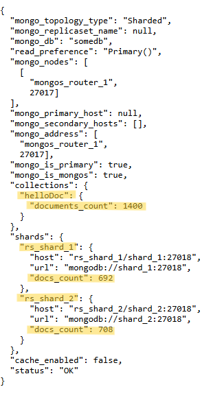

### Задание 2. Шардирование

Note: в соответствии с заданием, приложение должно выводить общее кол-во документов в коллекции, а также количество документов в каждом из шардов. Чтобы вывод соответствовал заданию, в `app.py` были внесены изменения.

Так же изменено развертывание инстанса приложения в `compose.yaml` - сейчас оно происходит не напрямую из образа `kazhem/pymongo_api:1.0.0`, а на основе файла `Dockerfile` (который уже в свою очередь использует образ `kazhem/pymongo_api:1.0.0`).

Такие изменения были сделаны чтобы была возможность запустить отредактированный `app.py`  

1. Запускаем все сервисы в `Docker`

```bash
docker compose up -d --build
```

2. Инициализация кластера и наполнение БД

```bash
./scripts/mongo-init.sh
```

3. Проверка при запуске проекта на локальной машине
   - откройте в браузере http://localhost:8080
   - список доступных эндпоинтов, swagger http://localhost:8080/docs

Результат работы приложения



4. Останавливаем контейнеры

```bash
docker compose down -v
```

---

<details>
<summary>Ручной пошаговый запуск, инициализация и проверка кластера</summary>


1. Запускаем все сервисы в `Docker`

```bash
docker compose up -d --build
```

---

2. Инициализация `set'а` серверов конфигурации

```bash
docker exec -it configSrv_1 mongosh --port 27019
```
или
```bash
docker exec -it configSrv_2 mongosh --port 27019
```
в зависимости из какого контейнера будем проводить инициализацию - будут назначаться `primary` и `secondary` роли
```bash
rs.initiate({
  _id : "rs_configSrv",
  configsvr: true,
  members: [
    { _id : 0, host : "configSrv_1:27019" },
    { _id : 1, host : "configSrv_2:27019" }
  ]
});

exit();
```

---

3. Инициализация шардов

Инициализируем первый шард
```bash
docker exec -it shard_1 mongosh --port 27018
```

```bash
rs.initiate(
  {
    _id : "rs_shard_1",
      members: [
        { _id : 0, host : "shard_1:27018" },
      ]
    }
);

exit();
```

Инициализируем второй шард
```bash
docker exec -it shard_2 mongosh --port 27018
```

```bash
rs.initiate(
  {
    _id : "rs_shard_2",
      members: [
        { _id : 0, host : "shard_2:27018" },
      ]
    }
);

exit();
```

---

4. Инициализация роутеров и наполнение БД

Инициализация
```bash
docker exec -it mongos_router_1 mongosh
```

```bash
sh.addShard( "rs_shard_1/shard_1:27018");
sh.addShard( "rs_shard_2/shard_2:27018");
```

Включаем шардирование
```bash
sh.enableSharding("somedb");
sh.shardCollection("somedb.helloDoc", { "name" : "hashed" } )
```

Наполняем БД
```bash
use somedb

for(var i = 0; i < 1400; i++) db.helloDoc.insertOne({age:i, name:"ly"+i})

db.helloDoc.countDocuments()

exit()
```

---

5. Проверка настроек серверов конфигурации

```bash
docker exec -it configSrv_1 mongosh --port 27019
```
или
```bash
docker exec -it configSrv_2 mongosh --port 27019
```

```bash
rs.status()
```

Интересные поля в результате проверки
```md
set: 'rs_configSrv'
configsvr: true,
members: [
  name: 'configSrv_1:27019',
  stateStr: 'PRIMARY',
  syncSourceHost: '',
  self: true,
]
```

---

6. Проверка статуса реплики на каждом шарде
```bash
docker exec -it shard_1 mongosh --port 27018
```
или
```bash
docker exec -it shard_1 mongosh --port 27018
```

```bash
rs.status()
```

Другие команды для проверки статусов
```bash
docker exec -it shard_1 bash -c "echo 'rs.help()' | mongosh --port 27018"
```

```bash
docker exec -it shard_1 bash -c "echo 'rs.printReplicationInfo()' | mongosh --port 27018"
```

```bash 
docker exec -it shard_1 bash -c "echo 'rs.printSlaveReplicationInfo()' | mongosh --port 27018"
```

---

7. Проверка распределения записей БД по шардам
```bash
docker exec -it shard_1 mongosh --port 27018
```

```bash
use somedb;

db.helloDoc.countDocuments();

exit();
```

```bash
docker exec -it shard_2 mongosh --port 27018
```

```bash
use somedb;

db.helloDoc.countDocuments();

exit();
```

---

8. Проверка статуса шардированного кластера
```bash
docker exec -it mongos_router_1 mongosh
```

```bash
sh.status()
```

---

9. Проверка статуса БД
```bash
docker exec -it mongos_router_1 mongosh
```

```bash
use somedb

db.stats()
```

```bash
db.helloDoc.getShardDistribution()
```

---

10. Останавливаем контейнеры и удаляем `volume` 
```bash
docker compose down -v
```

</details>

---
