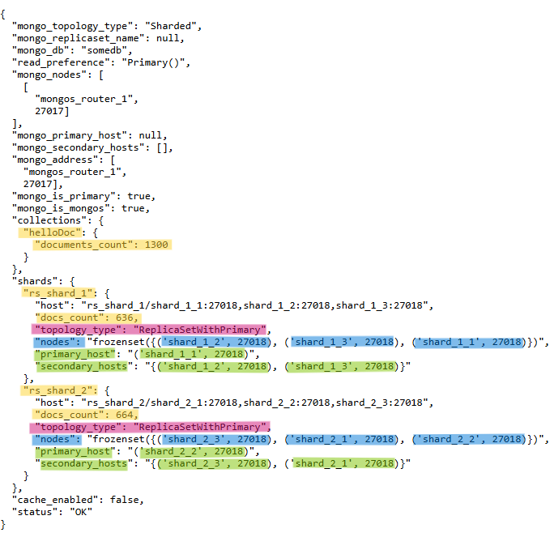

### Задание 3. Репликация

> Note: в соответствии с заданием, приложение должно выводить общее кол-во документов в коллекции, количество документов в каждом из шардов и информацию по репликам. Чтобы вывод соответствовал заданию, в `app.py` были внесены изменения.
>
> Так же изменено развертывание инстанса приложения в `compose.yaml` - сейчас оно происходит не напрямую из образа `kazhem/pymongo_api:1.0.0`, а на основе файла `Dockerfile` (который уже в свою очередь использует образ `kazhem/pymongo_api:1.0.0`).
>
> Такие изменения были сделаны чтобы была возможность запустить отредактированный `app.py`

1. Запускаем все сервисы в `Docker`

```bash
docker compose up -d --build
```

2. Инициализация кластера и наполнение БД

```bash
./scripts/mongo-init.sh
```

3. Проверка при запуске проекта на локальной машине
  - откройте в браузере http://localhost:8080
  - список доступных эндпоинтов, swagger http://localhost:8080/docs

Результат работы приложения



4. Останавливаем контейнеры

```bash
docker compose down -v
```

---

<details>
<summary>Проверка настроек кластера</summary>

1. Проверка настроек серверов конфигурации

```bash
docker exec -it configSrv_1 mongosh --port 27019
```

```bash
rs.status()
```

---

2. Проверка статуса реплики на каждом шарде
```bash
docker exec -it shard_1_1 mongosh --port 27018
```

```bash
rs.status()
```

Другие команды для проверки статусов
```bash
docker exec -it shard_1_1 bash -c "echo 'rs.help()' | mongosh --port 27018"
```

```bash
docker exec -it shard_1_1 bash -c "echo 'rs.printReplicationInfo()' | mongosh --port 27018"
```

```bash 
docker exec -it shard_1_1 bash -c "echo 'rs.printSlaveReplicationInfo()' | mongosh --port 27018"
```

---

3. Проверка распределения записей БД по шардам
```bash
docker exec -it shard_1_1 mongosh --port 27018
```

```bash
use somedb;

db.helloDoc.countDocuments();

exit();
```

```bash
docker exec -it shard_2_1 mongosh --port 27018
```

```bash
use somedb;

db.helloDoc.countDocuments();

exit();
```

---

4. Проверка статуса шардированного кластера
```bash
docker exec -it mongos_router_1 mongosh
```

```bash
sh.status()
```

---

5. Проверка статуса БД
```bash
docker exec -it mongos_router_1 mongosh
```

```bash
use somedb

db.stats()
```

```bash
db.helloDoc.getShardDistribution()
```

---

6. Останавливаем контейнеры и удаляем `volume`
```bash
docker compose down -v
```

</details>

---