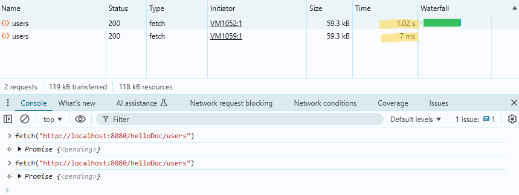
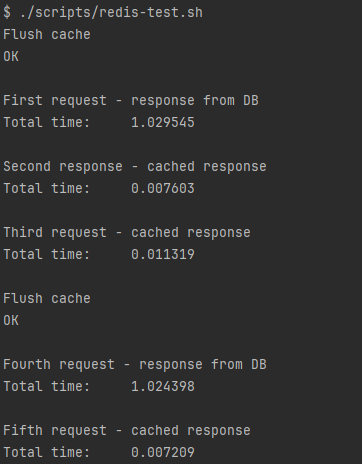

### Задание 4. Кэширование. Использование Redis в stand-alone режиме

> Note: в соответствии с заданием, приложение должно выводить общее кол-во документов в коллекции, количество документов в каждом из шардов и информацию по репликам. Чтобы вывод соответствовал заданию, в `app.py` были внесены изменения.
>
> Так же изменено развертывание инстанса приложения в `compose.yaml` - сейчас оно происходит не напрямую из образа `kazhem/pymongo_api:1.0.0`, а на основе файла `Dockerfile` (который уже в свою очередь использует образ `kazhem/pymongo_api:1.0.0`).
>
> Такие изменения были сделаны чтобы была возможность запустить отредактированный `app.py`

1. Запускаем все сервисы в `Docker`

```bash
docker compose up -d --build
```

2. Инициализация кластера MongoDB и наполнение БД 

```bash
./scripts/mongo-init.sh
```

3. Проверка работы проекта при запуске на локальной машине
- откройте в браузере http://localhost:8080
- список доступных эндпоинтов, swagger http://localhost:8080/docs

4. Проверка работы Redis на кэшированном эндпоинте через браузер
- откройте в браузере http://localhost:8080/helloDoc/users

Результат - первый запрос долгий (к БД), второй и последующие (до сброса кэша) - быстрые (к Redis)



5. Проверка работы Redis на кэшированном эндпоинте с помощью `cUrl`

```bash
./scripts/redis-test.sh
```

Результат



6. Получение расширенной статистики запроса

```bash
curl -s -w '\nLookup time:\t%{time_namelookup}\nConnect time:\t%{time_connect}\nPreXfer time:\t%{time_pretransfer}\nStartXfer time:\t%{time_starttransfer}\n\nTotal time:\t%{time_total}\n' -o /dev/nul "http://localhost:8080/helloDoc/users"
```

- `time_namelookup` - время, затраченное на преобразование доменного имени в IP-адрес
- `time_connect` - время, затраченное на подключение к удаленному серверу по TCP
- `time_pretransfer` - время, затраченное на подготовку к обмену данными (включает в себя «обмен рукопожатиями»)
- `time_starttransfer` - время, затраченное на действия до начала передачи первого байта данных (включает в себя time_pretransfer)

7. Останавливаем контейнеры

```bash
docker compose down -v
```


